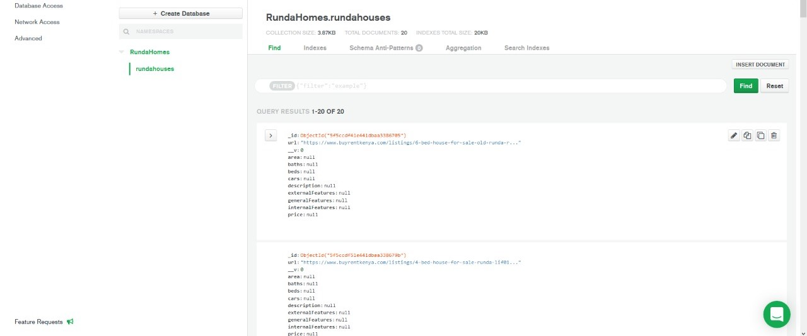

<SEO title="Using machine learning techniques to deterimine housing prices in runda" description="End to end
datascience project for determining housing prices in runda" />


The main objective for this series is as follows :
* [Setup our environment](https://wamaithanyamu.com/house-prices-machine-learning-models-in-runda-part-one/)
* Scrape data from [buyrentkenya.com](https://buyrentkenya.com) (You are here)
* Clean the data
* Exploratory Data Analysis (EDA)
* Build machine learning models
* Conclusion on findings
* Make a webapp to query the model

We'll start off by first scraping all the links for all the ads in the category we want. This is because visiting the
specific url for each ad has more useful information we can use to predict our prices. On the landing page, we just
have a list of houses.


Specific features and house description are missing from the listings.


# Utility functions

We'll first define some utility functions that we'll keep reusing in the  code.

Make a file utlity_functions.js.

1. A sleep function
The sleep function takes in a value and halts the program for the specified value in milliseconds

```javascript
    const Sleep = function(ms) {
        console.log('Sleeping for ', ms);

        return new Promise((resolve) => {
            setTimeout(resolve, ms);
        });
    }

```

2. A function that connects to mongodb using the mongo uri we saved in our .env file

* First we load mongoose
* Then we retrieve our mongodb uri from the .env file. To do this we need to import dotenv and its associated
functions that read data in our .env file
* We then connect to mongoose using the mongouri

```javascript
    // imports at the top of our utlity_functions.js
    const mongoose = require('mongoose');
    mongoose.Promise = global.Promise;
    const dotenv = require("dotenv");
    dotenv.config();

    //Mongodb Atlas uri we are using to connect to the db
    const MONGOURI = process.env.MONGOURI;
    const connectToMongodb = async function () {
        /**
         * connects to the mongodb instance using the mongouri
         */
        try{
            console.log("Connecting to mongo");

            mongoose.connect(MONGOURI,{
                useNewUrlParser: true,
                useUnifiedTopology: true,
                useCreateIndex: true,
                useFindAndModify: false
            });

            console.log("Successfully connected to  mongo");

        }catch (e) {
            console.log("Error from connectToMongodb function ", e);
        }

    };


```
We will only need to run this function to connect to mongodb

3. A function that launched our headless browser. A headless browser is a browser without the gui. The scraper doesnt
 need the graphical user interface to scrape a website thus the term headless. Our function will return us the
 browser object. We need to import puppeteer for this.

 ```javascript
  // imports at the top of our utlity_functions.js
    const puppeteer = require('puppeteer'); // < ----- import puppeteer
    const mongoose = require('mongoose');
    mongoose.Promise = global.Promise;
    const dotenv = require("dotenv");
    dotenv.config();

    // our previous functions - sleep and connect mongo go here
    ...
 const Browser = async function (){
     /**
      * @return browser - returns the browser instance launched by puppeteer
      */
     try{
         console.log("Launching browser...");
         await connectToMongodb();
         const browser = await puppeteer.launch({
             headless: false,
             args : [
                 '--no-sandbox',
                 '--disable-setuid-sandbox',
                 '--disable-gpu',
                 '--disable-dev-shm-usage',
                 '--disable-setuid-sandbox',
                 '--no-first-run',
                 '--no-sandbox',
                 '--no-zygote',
                 '--ignore-certificate-errors',
                 '--proxy-server="direct://"',
                 '--proxy-bypass-list=*',
                 '--hide-scrollbars',
                 '--mute-audio',
                 '--disable-gl-drawing-for-tests',
                 '--use-gl=swiftshader',
                 '--disable-infobars',
                 '--disable-breakpad',
                 '--disable-canvas-aa',
                 '--disable-2d-canvas-clip-aa',
                 '--deterministic-fetch',
                 // '--single-process', // <-  doesn't work on Windows
             ]
         });

         console.log("Successfully launched browser");
         return browser

     }catch (e) {
         console.log("This error is coming from the getBrowser function", e);
     }
 }

 ```
When headless is false the GUI part of the browser is launched. This is helpful when you want to see what is going on
with the scraper. We will see how this works shortly.The args array just optimises the browser as much as possible.
The function then returns the browser object. Think of it as you manually starting your chrome browser.

4 . A function that removes any html elements in a string. For example, it takes in a string
```javascript
  "<a>hello there? <br/> are you fine</a>"

```
and returns
```javascript
   "hello there? are you fine"

```
This happens very often when we are scraping the innerhtml of an element. We will see some examples of this.

```javascript
    let removeHtmlTags = async function (string, array){
        /**
         * @param {String} string takes in the string you want stripped of html elements
         * @param {Array} array takes in an array of tags you want to keep in the string
         * @return {String}  returns the string of stripped html or with the tags you specified maintained
         */
        try {

            return array ? string.split("<").filter(function(val){ return f(array, val); }).map(function(val){ return f(array, val); }).join("") : string.split("<").map(function(d){ return d.split(">").pop(); }).join("");
            function f(array, value){
                return array.map(function(d){ return value.includes(d + ">"); }).indexOf(true) != -1 ? "<" + value : value.split(">")[1];
            }

        }catch (e) {
            console.log("This error is coming from the removeHtmlTags function",e);
        }


    }

```
5 . A function that takes in data and checks if it has been stored in the db. If not it saves it. This is useful when
 making sure we do not have repeated saves. The function relies on our data type and schema. More on schemas later

 ```javascript


const singleADCheckIfInDb = async function (SINGLEAD, url, newPrice, beds, baths, cars, lastArea, generalFeatures, internalFeatures, externalFeatures, description) {

    console.log("checking if in db");

    let query = {url:url};
    let update = {
        $set: {
            url: url,
            price : newPrice,
            beds : beds,
            baths: baths,
            cars : cars,
            area: lastArea,
            generalFeatures :generalFeatures,
            internalFeatures : internalFeatures,
            externalFeatures: externalFeatures,
            description: description

        }
    };

    await Sleep(1000);
    let options = { upsert: true, returnOriginal:false };

    SINGLEAD.findOneAndUpdate(query, update, options, (err, doc)=>{
        if (err) {
            console.log("Something wrong when updating data!",err);
        }
        console.log("Saved to db!", doc);
    });


};


 ```
Finally we need to export all these function for use in other files.

``` javascript

module.exports = {Sleep, Browser,singleADCheckIfInDb,connectToMongodb, removeHtmlTags};
```
If you got lost in any part of these functions feel free to refer to the utlity_functions.js file [here](https://github.com/wamaithaNyamu/RUNDAHOUSES/blob/master/utility_functions.js)
. You're doing great.


We need to first scrape the links for all ads. To store this links to mongodb, we need to model the structure of the
data we will be storing in mongodb. Think of all the data we'll need even on the individual ad page. Inspect an
individual ad to figure out the data we will be storing. So here's a list of the items we'll be scraping:

* Url of the specific ad
* Price of house
* Number of bedrooms
* Number of bathrooms
* Description of the house
* Area the house occupies
* General features
* Internal features
* External features
* Available parking space

Create a new file Model.js. The data model is called a schema.

```javascript
    const mongoose = require("mongoose");

    //schema

    const allUrlsSchema = new mongoose.Schema({
        url : {
            type: String,
        },
        price : {
            type: Number,
        },
        beds : {
            type: Number,
        },
        baths : {
            type: Number,
        },
        cars : {
            type: Number,
        },
        area : {
            type: Number,
        },
        generalFeatures : {
            type: Array,
            default: []
        },
        internalFeatures : {
            type: Array,
            default: []
        },
        externalFeatures  : {
            type: Array,
            default: []
        },
        description  : {
            type: String,

        }

    });

    module.exports = allUrlsSchema
```

With our schema defined we now need to start the webscraping

We need to connect to mongo then launch the browser. Create a new file scraper.js. This is the script that we'll run
to do the scraping. Import our utility functions and our schema. In scraper.js we :

```javascript
   //imports in scraper.js
    const utilities = require('./utility_functions.js')
    const allUrlsSchema = require('./model.js');

    async function launchPage() {

        try {
        //  get the browser
            const browser = await utilities.Browser();
        //  connect to mongodb
            await utilities.connectToMongodb();
        //open new page in the browser and return the page
            const page = await browser.newPage();
            return page;

        } catch (e) {
            console.log("this error is coming from scrapeDailyNation", e);
        }

    }


async function main() {
    try {
        let page = await launchPage(BuyRentUrl);

    } catch (e) {
        console.log(" Error from main : ", e)
    }
}


main() // < ---will call all functions on this file

```
The launchPage connects to mongodb, launches a browser and opens a new page on the browser. We now need to navigate
to the url we will be scraping

```javascript

    // url we are scraping housing prices
    const BuyRentUrl = "https://www.buyrentkenya.com/houses-for-sale/westlands/runda?page=1";


```

A closer look at the url, we have a trailing number that shows the page we are on. If we look at the ads page, the
breadcrumbs go upto page 7. With this we can use a for loop to traverse all pages .


On page 7 our url would then be :

```javascript

    // url we are scraping housing prices
    const BuyRentUrl = "https://www.buyrentkenya.com/houses-for-sale/westlands/runda?page=7";


```
We have a page from the launchPage function, we want to take that page and navigate to the first page of our buyrent
runda category, scrape links on that page then navigate to the second page and repeat until we get to page 7. All the
 while, saving the links to mongodb. We do that by :

 ```javascript
 //our import here
 // our launch page function is here

 // url we are scraping housing prices
 const BuyRentUrl = "https://www.buyrentkenya.com/houses-for-sale/westlands/runda?page="; //<-- without number.

 async function getAllLinksOnPage(page) {
     /**
      * Gets all links in the current page
      * Stores them to the db
      */
     try {
         console.log("On landing page");
         // for loop that loops from 1 -7
         for (let i = 1; i < 9; i++) {
             let currentUrl = BuyRentUrl + i; //<---add the page number programatically
             console.log("The current url is ", currentUrl)
             await page.goto(currentUrl, {timeout: 180000}); //<--- go to current url page being scraped
             console.log("On page ", i)
             console.log('Getting details');
             const selector = ".property-title > a" // < --- the property title is enclosed in <a> tags.
             await page.waitForSelector(selector);

             //store all links on current page in variable linsk
             const links = await page.$$eval(selector, am => am.filter(e => e.href).map(e => e.href)); //<--get hrefs
             console.log(links)

             // we have the links now we need to store them to the db
             // remember our import of the schema
             let schema = await allUrlsSchema;

             // the mongoose.model function takes in two args, the collection name and the schema. We already
             // specified our schema so our data will be saved in a collection named RundaHouses.
             let ALLLINKS = await mongoose.model('RundaHouses', schema);


             for (let i = 0; i < links.length; i++) {
                 allLinks.push(links[i]);

                 //the singleADCheckIfInDb utlity function takes in a mongoose model and data specified
                 await utilities.singleADCheckIfInDb(ALLLINKS, links[i]);
             }

         }


     } catch (e) {
         console.log("this error is coming from getAllLinksOnPage", e);
     }

 }


 async function main() {
     try {
         let page = await launchPage(BuyRentUrl);
         await getAllLinksOnPage(page) // <---pass the page to this func

     } catch (e) {
         console.log(" Error from main : ", e)
     }
 }


 main() // < ---will call all functions on this file

 ```


I know you are wondering why we passed only the link yet the schema defines other types of data as well. By default
mongoose will assign a null value to data that is missing. Run the scraper.js  in your terminal with :

```javascript
    node scraper.js
```

You should see a browser launched and the following values in your database



The scraper will go through all 7 pages and store the links in mongo. So now we need to deal with the null values. We
 have individual ad links whats left is to visit each link and scrape the necessary data.


From our checklist :

* Url of the specific ad ✅
* Price of house
* Number of bedrooms
* Number of bathrooms
* Description of the house
* Area the house occupies
* General features
* Internal features
* External features
* Available parking space

To extract these elements, we need to get the innerhtml and remove any html tags in the inner html. Create a function
 getDetail that takes in the page as an argument and a selector. Such that :

```javascript

    async function getDetail(page, selector) {
        /**
         * @param {object} page current page the browser is on
         * @param {string} selector - selector of the element
         * @return {String} the value of the innerhtmls without html tags
         */
        try {
            let element = (await page.$(selector)) || ""; // < --- await element with selector to appear in DOM
            if (element !== "") {
                const el = await page.$eval(selector, (element) => {
                    return element.innerHTML; // < --- has inner htmls

                });
                return await utilities.removeHtmlTags(el); // < --- removes html tags

            } else {
                console.log("No such element"); // <--- if element is not in dom
                return 0;//<-- return zero since this function is for the number values
            }


        } catch (e) {
            console.log('Error from get area function', e);
        }

    }

```
We need a function that iterates through each link


Now let's get the price of the house. Inspect the price element from your devtools and extract the css selector.

```javascript
...
async function getPrice(page) {
    //    get price
    try {
        // this function either returns a zero or a number

        // first extract the inner html from the function we defined above
        const price = await getDetail(page, ".amenities-grid > .body-left > .info-row > .item-price > .text-primary");
        // price returns the price as KES 20,000,000
        // split the price into KES and 20,000,000
        const newPrice = price.split(' ')[2]
        //remove all commas from 20,000,000 to get 20000000
        const cleanPrice = newPrice.replace(/,/g, '')
        // convert the string to integer
        let finalPrice = parseInt(cleanPrice);
        console.log("price", finalPrice);
        // In some cases the string is Nan if the agent did not indicate a price on our given selector
        if(isNaN(finalPrice)){
        // This stores the price as zero to avoid conflicts in adding data to mongo
          return 0
        }else{
          // in our example the final price would be 20000000  as an int
          return finalPrice
        }


    } catch (e) {
        console.log("This error is coming from getPrice ", e)
    }
}


   async function main() {
     try {
         let page = await launchPage(BuyRentUrl);
         await getAllLinksOnPage(page) // <---pass the page to this func and get all links
         await getPrice(page) // <--- extract price
     } catch (e) {
         console.log(" Error from main : ", e)
     }
   }


```
* Price of house ✅

```javascript
...
//empty arrays to append the  links
allLinks = []

....


async function getDetails(page) {
    try {
        console.log("In get details");
        console.log("ALL LINKS ARE", allLinks.length);

        for (let i = 0; i < allLinks.length; i++) {
            await page.goto(allLinks[i], {timeout: 180000});
            //get price
            let price = await getPrice(page);

            //    get beds
            const beds = await getDetail(page, ".col-lg-12 > .table-cell > .info-row > p > .h-beds");

            console.log("beds", beds)

            //    get baths
            const baths = await getDetail(page, ".col-lg-12 > .table-cell > .info-row > p > .h-baths");
            console.log("baths", baths)

            //    get cars
            const cars = await getDetail(page, ".col-lg-12 > .table-cell > .info-row > p > .h-garage");
            console.log("cars", cars)

            let general, internal, external = [];

            //    get general features
            general = await page.evaluate(() => {
                const lis = Array.from(document.querySelectorAll('div.col-md-4:nth-child(1) > div:nth-child(1) >' +
                    ' div:nth-child(2) li'))
                return lis.map(li => li.textContent)
            });
            console.log("general ", typeof (general), general, general[0]);


            //    get internal features
            internal = await page.evaluate(() => {
                const lis = Array.from(document.querySelectorAll('div.col-md-4:nth-child(3) > div:nth-child(1) >' +
                    ' div:nth-child(2) li'))
                return lis.map(li => li.textContent)
            });
            console.log("internal ", typeof (internal), internal, internal[0]);

            //   get external features
            external = await page.evaluate(() => {
                const lis = Array.from(document.querySelectorAll('div.col-md-4:nth-child(2) > div:nth-child(1) > div:nth-child(2) li'))
                return lis.map(li => li.textContent)
            });

            console.log("external ", typeof (external), external, external[0]);

            //    get description
            const description = await getDetail(page, '.mrc-content-wrap');
            console.log("desc ", description);


        }


    } catch
        (e) {
        console.log(" Error from get details : ", e)
    }
}


async function main() {
    try {
        let page = await launchPage(BuyRentUrl);
        await getAllLinksOnPage(page);
        await getDetails(page);

    } catch (e) {
        console.log(" Error from main : ", e)
    }
}


main()


```
* Url of the specific ad ✅
* Price of house ✅
* Number of bedrooms ✅
* Number of bathrooms ✅
* Description of the house ✅
* Area the house occupies ✅
* General features ✅
* Internal features ✅
* External features ✅
* Available parking space ✅


