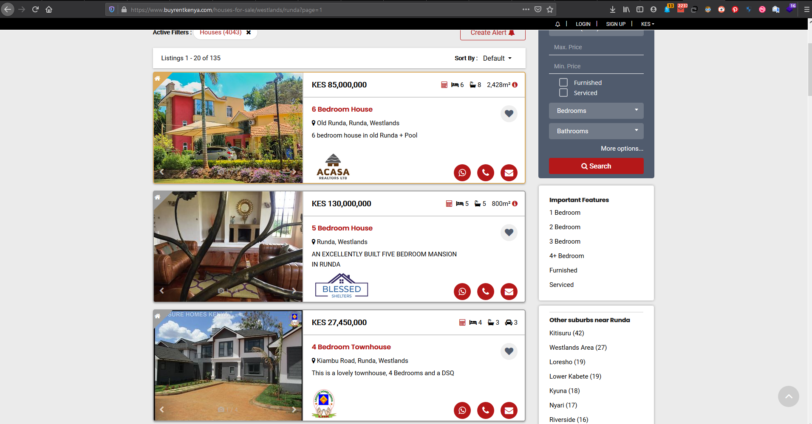
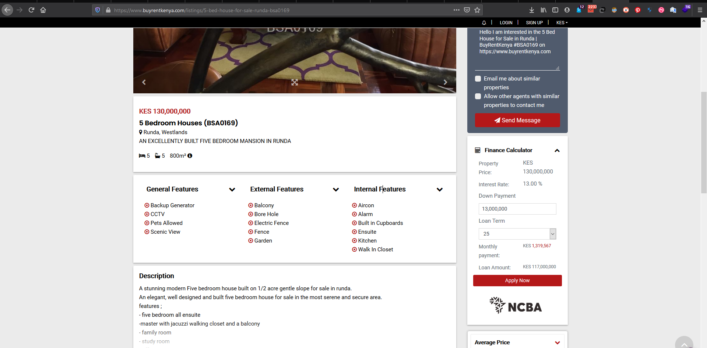
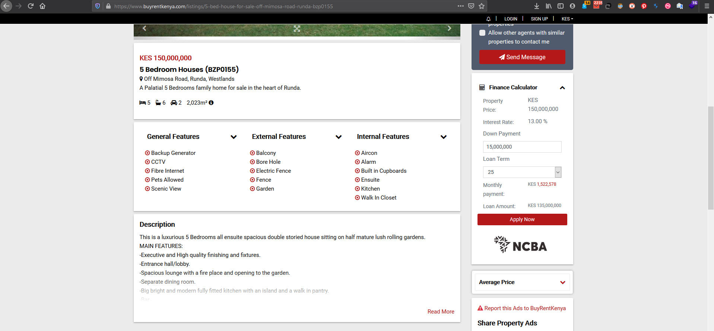
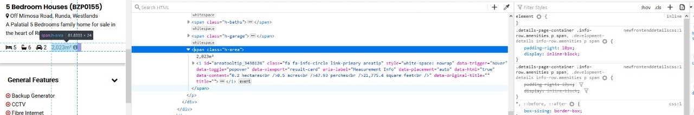
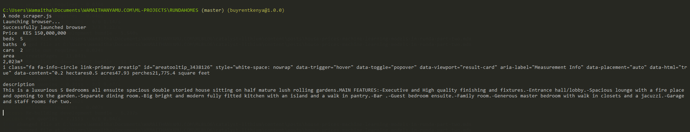
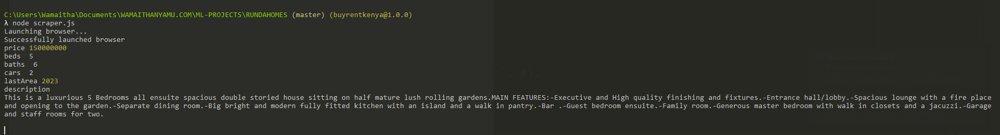
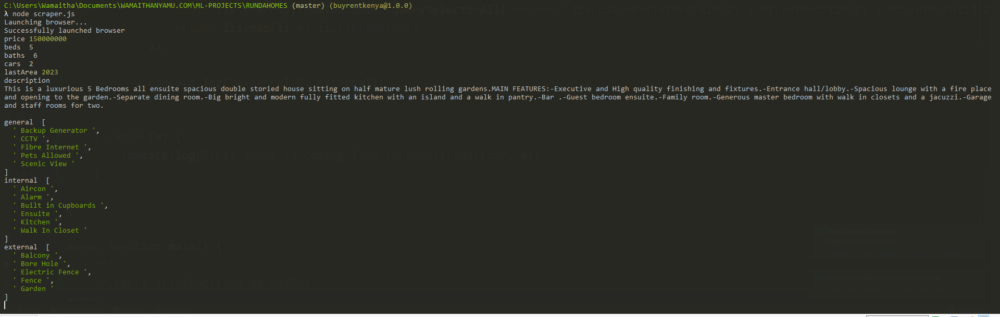
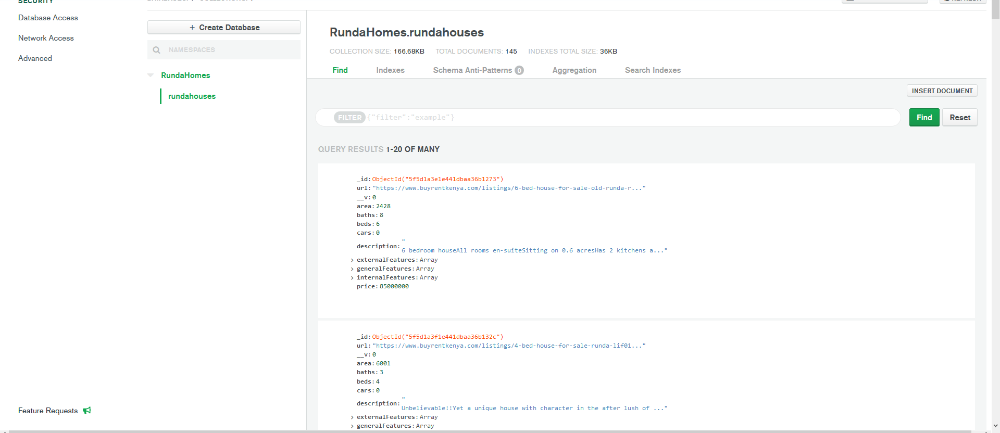

<SEO title="Using machine learning techniques to deterimine housing prices in runda" description="End to end
datascience project for determining housing prices in runda" />

In the previous post we set up our environment. In this post we will scrape the data we need. Buckle up its going to
be a long post.

The main objective for this series is as follows :
* [Setup our environment](../posts/house-prices-machine-learning-models-in-runda-part-one)
* Scrape data from [buyrentkenya.com](https://buyrentkenya.com) (You are here)
* [Transform data to csv](../posts/house-prices-machine-learning-models-in-runda-part-three)
* Clean the data
* Exploratory Data Analysis (EDA)
* Build machine learning models
* Conclusion on findings
* Make a webapp to query the model

We'll start off by first scraping all the links for all the ads in the category we want. This is because visiting the
specific url for each ad has more useful information we can use to predict our prices. On the landing page, we just
have a list of houses.



Specific features and house description are missing from the listings.



# Utility functions

We'll first define some utility functions that we'll keep reusing in the  code.

Make a file utlity_functions.js.

1. A sleep function
The sleep function takes in a value and halts the program for the specified value in milliseconds

```javascript
    const Sleep = function(ms) {
        console.log('Sleeping for ', ms);

        return new Promise((resolve) => {
            setTimeout(resolve, ms);
        });
    }

```

2. A function that connects to mongodb using the mongo uri we saved in our .env file

* First we load mongoose
* Then we retrieve our mongodb uri from the .env file. To do this we need to import dotenv and its associated
functions that read data in our .env file
* We then connect to mongoose using the mongouri

```javascript
    // imports at the top of our utlity_functions.js
    const mongoose = require('mongoose');
    mongoose.Promise = global.Promise;
    const dotenv = require("dotenv");
    dotenv.config();

    //Mongodb Atlas uri we are using to connect to the db
    const MONGOURI = process.env.MONGOURI;
    const connectToMongodb = async function () {
        /**
         * connects to the mongodb instance using the mongouri
         */
        try{
            console.log("Connecting to mongo");

            mongoose.connect(MONGOURI,{
                useNewUrlParser: true,
                useUnifiedTopology: true,
                useCreateIndex: true,
                useFindAndModify: false
            });

            console.log("Successfully connected to  mongo");

        }catch (e) {
            console.log("Error from connectToMongodb function ", e);
        }

    };


```


3. A function that will launch our headless browser. A headless browser is a browser without the graphical user
interface (GUI). The scraper doesn't  need the  to scrape a website thus the term headless. Our function will return us the
browser object. We will be using puppeteer to launch our headless  browser. Puppeteer is a project by google that
launches chromium in headless mode.

 ```javascript
  // imports at the top of our utlity_functions.js
    const puppeteer = require('puppeteer'); // < ----- import puppeteer

    ...

    // our previous functions - sleep and connect mongo go here
    ...
 const Browser = async function (){
     /**
      * @return browser - returns the browser instance launched by puppeteer
      */
     try{
         console.log("Launching browser...");
         await connectToMongodb();
         const browser = await puppeteer.launch({
             headless: false, //<--- when false the GUI launches, set to true if you dont want the GUI
             args : [
                 '--no-sandbox',
                 '--disable-setuid-sandbox',
                 '--disable-gpu',
                 '--disable-dev-shm-usage',
                 '--disable-setuid-sandbox',
                 '--no-first-run',
                 '--no-sandbox',
                 '--no-zygote',
                 '--ignore-certificate-errors',
                 '--proxy-server="direct://"',
                 '--proxy-bypass-list=*',
                 '--hide-scrollbars',
                 '--mute-audio',
                 '--disable-gl-drawing-for-tests',
                 '--use-gl=swiftshader',
                 '--disable-infobars',
                 '--disable-breakpad',
                 '--disable-canvas-aa',
                 '--disable-2d-canvas-clip-aa',
                 '--deterministic-fetch',
                 // '--single-process', // <-  doesn't work on Windows
             ]
         });

         console.log("Successfully launched browser");
         return browser

     }catch (e) {
         console.log("This error is coming from the getBrowser function", e);
     }
 }

 ```
When headless is false the GUI part of the browser is launched. This is helpful when you want to see what is going on
with the scraper. We will see how this works shortly.The args array just optimises the browser as much as possible.
The function then returns the browser object. Think of it as you manually starting your chrome browser.

4 . A function that removes any html elements in a string. For example, it takes in a string
```javascript
  "<a>hello there? <br/> are you fine</a>"

```
and returns
```javascript
   "hello there? are you fine"

```
This happens very often when we are scraping the innerhtml of an element. We will see some examples of this.

```javascript
    let removeHtmlTags = async function (string, array){
        /**
         * @param {String} string takes in the string you want stripped of html elements
         * @param {Array} array takes in an array of tags you want to keep in the string
         * @return {String}  returns the string of stripped html or with the tags you specified maintained
         */
        try {

            return array ? string.split("<").filter(function(val){ return f(array, val); }).map(function(val){ return f(array, val); }).join("") : string.split("<").map(function(d){ return d.split(">").pop(); }).join("");
            function f(array, value){
                return array.map(function(d){ return value.includes(d + ">"); }).indexOf(true) != -1 ? "<" + value : value.split(">")[1];
            }

        }catch (e) {
            console.log("This error is coming from the removeHtmlTags function",e);
        }


    }

```
5 . A function that takes in data and checks if it has been stored in the db. If the data has not been saved, the
function saves it. This will ensure that we do not save multiple objects for the same ad.
 ```javascript


const singleADCheckIfInDb = async function (SINGLEADMODEL, url, newPrice, beds, baths, cars, lastArea, generalFeatures,
internalFeatures, externalFeatures, description) {

    console.log("checking if in db");

    let query = {url:url};
    let update = {
        $set: {
            url: url,
            price : newPrice,
            beds : beds,
            baths: baths,
            cars : cars,
            area: lastArea,
            generalFeatures :generalFeatures,
            internalFeatures : internalFeatures,
            externalFeatures: externalFeatures,
            description: description

        }
    };

    let options = { upsert: true, returnOriginal:false };

    SINGLEADMODEL.findOneAndUpdate(query, update, options, (err, doc)=>{
        if (err) {
            console.log("Something wrong when updating data!",err);
        }
        console.log("Saved to db!", doc);
    });


};


```

A break down of the  singleADCheckIfInDb arguments:
SINGLEADMODEL : This is a mongoose model. A mongoose model is obtained by defining a schema and the collection name
.For example, in our db we want to have a collection of runda house, should you in future want to scrape houses from malindi, we would specify in our mongoose model. The mongoose model is defined as follows:


```javascript
     // for runda houses
     let SINGLEADMODEL = await mongoose.model('RundaHouses', schema);

     //if we wanted a collection on malindi houses we would define it as:
     let SINGLEADMODEL = await mongoose.model('MalindiHouses', schema);
```

- url, - The url of the current ad we are saving to the db
- newPrice - The price of the house in the ad
- beds - Number of bedrooms in the house
- baths - Number of bathrooms in the house
- cars - Available car parking space
- lastArea - The area the house sits on
- generalFeatures - General features such as borehole
- internalFeatures - Internal features such as walk in closets
- externalFeatures - External features such as swimming pool
- description - The description of the ad

We are using the url as the query because every house ad has a unique url. In the mongoose model function we had a
schema argument. A schema defines the data we will store in our database. Think of all the data we'll need even on
the individual ad page. Inspect an individual ad to figure out the data we will be storing.

Our schema :

```javascript
// Make a new file Model.js and save the schema below
    const mongoose = require("mongoose");

    //schema

    const allUrlsSchema = new mongoose.Schema({
        url : {
            type: String,
        },
        price : {
            type: Number,
        },
        beds : {
            type: Number,
        },
        baths : {
            type: Number,
        },
        cars : {
            type: Number,
        },
        area : {
            type: Number,
        },
        generalFeatures : {
            type: Array,
            default: []
        },
        internalFeatures : {
            type: Array,
            default: []
        },
        externalFeatures  : {
            type: Array,
            default: []
        },
        description  : {
            type: String,

        }

    });

    module.exports = allUrlsSchema
```

Save the schema in a new file ** Model.js **. We will use this later.

** NOTE : **

The names we gave to our data types in the schema should be the same as the names we use in our keys in the $set
dictionary in singleADCheckIfInDb


```javascript
    $set: {
            url: url, //<-- the url key must be same as in the schema
            price : newPrice, //<-- the price key must be same as in the schema
            beds : beds,
            baths: baths,
            cars : cars,
            area: lastArea,
            generalFeatures :generalFeatures,
            internalFeatures : internalFeatures,
            externalFeatures: externalFeatures,
            description: description

        }
```
Back to utlity_functions.js, we need to export this functions so that we can use them in other files.

``` javascript
...
//at the bottom of utility_functions.js
module.exports = {Sleep, Browser,singleADCheckIfInDb,connectToMongodb, removeHtmlTags};
```

The complete utility_functions.js :

```javascript
const puppeteer = require('puppeteer');
const mongoose = require('mongoose');
mongoose.Promise = global.Promise;
const dotenv = require("dotenv");
dotenv.config();

//Mongodb Atlas uri we are using to connect to the db
const MONGOURI = process.env.MONGOURI;

const connectToMongodb = async function () {
    /**
     * connects to the mongodb instance using the mongouri
     */
    try{
        console.log("Connecting to mongo");

        mongoose.connect(MONGOURI,{
            useNewUrlParser: true,
            useUnifiedTopology: true,
            useCreateIndex: true,
            useFindAndModify: false
        });

        console.log("Successfully connected to  mongo");

    }catch (e) {
        console.log("Error from connectToMongodb function ", e);
    }

};

const Browser = async function (){
    /**
     * @return browser - returns the browser instance launched by puppeteer
     */
    try{
        console.log("Launching browser...");
        await connectToMongodb();
        const browser = await puppeteer.launch({
            headless: false,
            args : [
                '--no-sandbox',
                '--disable-setuid-sandbox',
                '--disable-gpu',
                '--disable-dev-shm-usage',
                '--disable-setuid-sandbox',
                '--no-first-run',
                '--no-sandbox',
                '--no-zygote',
                '--ignore-certificate-errors',
                '--proxy-server="direct://"',
                '--proxy-bypass-list=*',
                '--headless',
                '--hide-scrollbars',
                '--mute-audio',
                '--disable-gl-drawing-for-tests',
                '--use-gl=swiftshader',
                '--disable-infobars',
                '--disable-breakpad',
                '--disable-canvas-aa',
                '--disable-2d-canvas-clip-aa',
                '--deterministic-fetch',
                // '--single-process', // <-  doesn't work on Windows
            ]
        });

        console.log("Successfully launched browser");
        return browser

    }catch (e) {
        console.log("This error is coming from the getBrowser function", e);
    }
}


const Sleep= function(ms) {
    console.log('Sleeping for ', ms);

    return new Promise((resolve) => {
        setTimeout(resolve, ms);
    });
}


const singleADCheckIfInDb = async function (SINGLEADMODEL, url, newPrice, beds, baths, cars, lastArea, generalFeatures, internalFeatures, externalFeatures, description) {

    console.log("checking if in db");

    let query = {url:url};
    let update = {
        $set: {
            url: url,
            price : newPrice,
            beds : beds,
            baths: baths,
            cars : cars,
            area: lastArea,
            generalFeatures :generalFeatures,
            internalFeatures : internalFeatures,
            externalFeatures: externalFeatures,
            description: description

        }
    };

    await Sleep(1000); //<---the Sleep function we defined earlier

    let options = { upsert: true, returnOriginal:false };

    SINGLEADMODEL.findOneAndUpdate(query, update, options, (err, doc)=>{
        if (err) {
            console.log("Something wrong when updating data!",err);
        }
        console.log("Saved to db!", doc);
    });


};

let removeHtmlTags = async function (string, array){
    /**
     * @param {String} string takes in the string you want stripped of html elements
     * @param {Array} array takes in an array of tags you want to keep in the string
     * @return {String}  returns the string of stripped html or with the tags you specified maintained
     */
    try {

        return array ? string.split("<").filter(function(val){ return f(array, val); }).map(function(val){ return f(array, val); }).join("") : string.split("<").map(function(d){ return d.split(">").pop(); }).join("");
        function f(array, value){
            return array.map(function(d){ return value.includes(d + ">"); }).indexOf(true) != -1 ? "<" + value : value.split(">")[1];
        }

    }catch (e) {
        console.log("This error is coming from the removeHtmlTags function",e);
    }


}


module.exports = {Sleep, Browser,singleADCheckIfInDb,connectToMongodb, removeHtmlTags};

```
If you got lost in any part of these functions feel free to refer to the utlity_functions.js file [here](https://github.com/wamaithaNyamu/RUNDAHOUSES/blob/master/utility_functions.js)
. You're doing great.


Create a new file scraper.js. This is the script that we'll run to do the scraping. Import our utility functions and our schema. In scraper.js we :


```javascript
   //imports in scraper.js
    const utilities = require('./utility_functions.js') //< --- utility_functions
    const allUrlsSchema = require('./model.js'); //<-- our schema

    async function launchPage() {
   /**
     * @return page {Object}  returns the string of stripped html or with the tags you specified maintained
     */
        try {
        //  get the browser
            const browser = await utilities.Browser();
        //  connect to mongodb
            await utilities.connectToMongodb();
        //open new page in the browser and return the page
            const page = await browser.newPage();
            return page;

        } catch (e) {
            console.log("this error is coming from scrapeDailyNation", e);
        }

    }


async function main() {
    /**
      * calls all functions we define
     */
    try {
        let page = await launchPage(); // <---store the page object in the page variable

    } catch (e) {
        console.log(" Error from main : ", e)
    }
}


main() // < ---will call all functions on this file

```


Before we visit each page, get all the links then visit the individual link, we'll start by first defining functions
to extract all the necessary data in the single ad page. I've picked out a perfect add as our test testUrl


The ad has everything we'll need. In your scraper.js :
 ```javascript
    const utilities = require('./utility_functions.js') //< --- utility_functions
     const testUrl = "https://www.buyrentkenya.com/listings/5-bed-house-for-sale-off-mimosa-road-runda-bzp0155"

     async function launchPage() {
    /**
      * @return page {Object}  returns the string of stripped html or with the tags you specified maintained
      */
         try {
         //  get the browser
             const browser = await utilities.Browser();
             const page = await browser.newPage();
             return page;

         } catch (e) {
             console.log("this error is coming from scrapeDailyNation", e);
         }

     }

 async function getDetails(url, page){
 /**
       * @param url {String} - the string of the url we are scraping
       * @param page {Object} - current blank page
       * @return page {Object}  returns the string of stripped html or with the tags you specified maintained
       */
          try {
          //navigate to the url
             await page.goto(url, {timeout: 180000});

          } catch (e) {
              console.log("this error is coming from scrapeDailyNation", e);
          }

 }
 async function main() {
     /**
       * calls all functions we define
      */
     try {
         let page = await launchPage(); // <---store the page object in the page variable
         await getDetails(testUrl, page) // <-- pass the page object from the launch page and the test url
     } catch (e) {
         console.log(" Error from main : ", e)
     }
 }


 main() // < ---will call all functions on this file


 ```

Run this script with :

```javascript
    node scraper.js

```
 We'll start by defining a function that generalises to all elements we want. The getDetail function takes in the
 page object and a selector. For example, if we pass the selector of the area element, the function returns the
 innerhtml of the selector and removes its html. Here's what I mean :
 

 From the above snippet of the devtools, the innerhtml of the area ** h-area ** selector is :

 ```javascript

2,023m²
<i class="fa fa-info-circle link-primary areatip" id="areatooltip_3438126" style="white-space: nowrap" data-trigger="hover" data-toggle="popover" data-viewport="result-card" aria-label="Measurement Info" data-placement="auto" data-html="true" data-content="0.2 hectares<br />0.5 acres<br />47.93 perches<br />21,775.4 square feet<br />" data-original-title="" title=""></i>

```
We want to get just the area 2,023m² but the inner html has some unwanted html elements. These are filtered out by
the removeHtmlTags function we wrote in utility_functions.js

Here's the getDetail function:


```javascript

    ...
    async function getDetail(page, selector) {
        /**
         * @param {object} page current page the browser is on
         * @param {string} selector - selector of the element
         * @return {String} the value  without html tags
         */
        try {
            let element = (await page.$(selector)) || ""; // < --- await element with selector to appear in DOM
            if (element !== "") {
                const el = await page.$eval(selector, (element) => {
                    return element.innerHTML; // < --- has inner htmls

                });
                return await utilities.removeHtmlTags(el); // < --- removes html tags

            } else {
                console.log("No such element"); // <--- if element is not in dom
                return 0;//<-- return zero since this function is for the number values
            }


        } catch (e) {
            console.log('Error from get area function', e);
        }

    }

    ...

```


Note that our getDetail function doesnt take care of our features as they are in a list. The $eval method is used
when retrieving a single selector not for arrays. We'll handle generalFeatures, internalFeatures and externalFeatures
separately!

We'll define a new function getDetails that extract all our data.
Our scraper.js now looks like this :

```javascript
 const utilities = require('./utility_functions.js') //< --- utility_functions
  const testUrl = "https://www.buyrentkenya.com/listings/5-bed-house-for-sale-off-mimosa-road-runda-bzp0155"

      async function launchPage() {
     /**
       * @return page {Object}  returns the string of stripped html or with the tags you specified maintained
       */
          try {
          //  get the browser
              const browser = await utilities.Browser();
              const page = await browser.newPage();
              return page;

          } catch (e) {
              console.log("this error is coming from scrapeDailyNation", e);
          }

      }
  async function getDetail(page, selector) {
         /**
          * @param {object} page current page the browser is on
          * @param {string} selector - selector of the element
          * @return {String} the value  without html tags
          */
         try {
             let element = (await page.$(selector)) || ""; // < --- await element with selector to appear in DOM
             if (element !== "") {
                 const el = await page.$eval(selector, (element) => {
                     return element.innerHTML; // < --- has inner htmls

                 });
                 return await utilities.removeHtmlTags(el); // < --- removes html tags

             } else {
                 console.log("No such element"); // <--- if element is not in dom
                 return 0;//<-- return zero since this function is for the number values
             }


         } catch (e) {
             console.log('Error from get area function', e);
         }

     }

  async function getDetails(url, page){
  /**
        * @param url {String} - the string of the url we are scraping
        * @param page {Object} - current blank page
        * @return page {Object}  returns the string of stripped html or with the tags you specified maintained
        */
           try {
           //navigate to the url
              await page.goto(url, {timeout: 180000});
              //get price
              const price = await getDetail(page, ".amenities-grid > .body-left > .info-row > .item-price > .text-primary");
               console.log('Price', price)
              //    get beds
              const beds = await getDetail(page, ".col-lg-12 > .table-cell > .info-row > p > .h-beds");

              console.log("beds", beds)

              //    get baths
              const baths = await getDetail(page, ".col-lg-12 > .table-cell > .info-row > p > .h-baths");
              console.log("baths", baths)

              //    get cars
              const cars = await getDetail(page, ".col-lg-12 > .table-cell > .info-row > p > .h-garage");
              console.log("cars", cars)

             //get area
              const area = await getDetail(page, ".col-lg-12 > .table-cell > .info-row > p > .h-area");
              console.log('area', area)

              //    get description
              const description = await getDetail(page, '.mrc-content-wrap');
              console.log("description ", description);


           } catch (e) {
               console.log("this error is coming from scrapeDailyNation", e);
           }

  }
  async function main() {
      /**
        * calls all functions we define
       */
      try {
          let page = await launchPage(); // <---store the page object in the page variable
          await getDetails(testUrl, page) // <-- pass the page object from the launch page and the test url
      } catch (e) {
          console.log(" Error from main : ", e)
      }
  }


  main() // < ---will call all functions on this file


 ```
Run the script in your terminal. You should now get the following output once its done.


The data we get still not perfect. Note they're all in strings. We need to :

* Drop the KES in price and the commas and also transform the string to an integer
* The area still has html elements. Our removeHtmlTags missed them
* If you inspect some of the ads they have some missing element eg, some have no area specified. Challenge yourself
and do some housekeeping on your own. Here's my approach to cleaning all the mentioned issues:
```javascript
const utilities = require('./utility_functions.js') //< --- utility_functions
const testUrl = "https://www.buyrentkenya.com/listings/5-bed-house-for-sale-off-mimosa-road-runda-bzp0155"

async function launchPage() {
    /**
     * @return page {Object}  returns the string of stripped html or with the tags you specified maintained
     */
    try {
        //  get the browser
        const browser = await utilities.Browser();
        const page = await browser.newPage();
        return page;

    } catch (e) {
        console.log("this error is coming from scrapeDailyNation", e);
    }

}

async function getPrice(page) {
    //    get price
    try {

        const price = await getDetail(page, ".amenities-grid > .body-left > .info-row > .item-price > .text-primary");
        const newPrice = price.split(' ')[2]
        const cleanPrice = newPrice.replace(/,/g, '')
        let finalPrice = parseInt(cleanPrice);

        if (isNaN(finalPrice)) {
            return 0
        } else {

            return finalPrice
        }


    } catch (e) {
        console.log("This error is coming from getPrice ", e)
    }
}

async function getDetail(page, selector) {
    /**
     * @param {object} page current page the browser is on
     * @param {string} selector - selector of the element
     * @return {String} the value  without html tags
     */
    try {
        let element = (await page.$(selector)) || ""; // < --- await element with selector to appear in DOM
        if (element !== "") {
            const el = await page.$eval(selector, (element) => {
                return element.innerHTML; // < --- has inner htmls

            });
            return await utilities.removeHtmlTags(el); // < --- removes html tags

        } else {
            console.log("No such element"); // <--- if element is not in dom
            return 0;//<-- return zero since this function is for the number values
        }


    } catch (e) {
        console.log('Error from get area function', e);
    }

}

async function getDetails(url, page) {
    /**
     * @param url {String} - the string of the url we are scraping
     * @param page {Object} - current blank page
     * @return page {Object}  returns the string of stripped html or with the tags you specified maintained
     */
    try {
        //navigate to the url
        await page.goto(url, {timeout: 180000});
        //get price
            let price = await getPrice(page);
            console.log('price', price);
            //    get beds
            const beds = await getDetail(page, ".col-lg-12 > .table-cell > .info-row > p > .h-beds");

            console.log("beds", beds)

            //    get baths
            const baths = await getDetail(page, ".col-lg-12 > .table-cell > .info-row > p > .h-baths");
            console.log("baths", baths)

            //    get cars
            const cars = await getDetail(page, ".col-lg-12 > .table-cell > .info-row > p > .h-garage");
            console.log("cars", cars)

            //    get area
            let lastArea;
            const area = await getDetail(page, ".col-lg-12 > .table-cell > .info-row > p > .h-area");

            if (area === null || area === 0 ) {
                lastArea = 0;
                console.log("newArea", lastArea);

            } else {
                const newArea = area.split(/(?=[²³ⁿºʳᵈ™℠®])/)[0];
                const onlyArea = newArea.slice(0, -1);
                const cleanArea = onlyArea.replace(/,/g, '');
                 lastArea = parseInt(cleanArea);
                console.log("lastArea", lastArea)
            }

        //    get description
        const description = await getDetail(page, '.mrc-content-wrap');
        console.log("description ", description);


    } catch (e) {
        console.log("this error is coming from scrapeDailyNation", e);
    }

}

async function main() {
    /**
     * calls all functions we define
     */
    try {
        let page = await launchPage(); // <---store the page object in the page variable
        await getDetails(testUrl, page) // <-- pass the page object from the launch page and the test url
    } catch (e) {
        console.log(" Error from main : ", e)
    }
}


main() // < ---will call all functions on this file


```

Running the above yields :


I mentioned earlier that we handle lists differently in puppeteer. To extract the generalFeatures for example we need
 the following function :

```javascript
...
 let general = await page.evaluate(() => {
                const lis = Array.from(document.querySelectorAll('div.col-md-4:nth-child(1) > div:nth-child(1) >' +
                    ' div:nth-child(2) li'))
                return lis.map(li => li.textContent)
            });

 console.log("general ", general);

...

```
Our complete getDetails function will then be :

```javascript
async function getDetails(url, page) {
    /**
     * @param url {String} - the string of the url we are scraping
     * @param page {Object} - current blank page
     * @return page {Object}  returns the string of stripped html or with the tags you specified maintained
     */
    try {
        //navigate to the url
        await page.goto(url, {timeout: 180000});
        //get price
            let price = await getPrice(page);
            console.log('price', price);
            //    get beds
            const beds = await getDetail(page, ".col-lg-12 > .table-cell > .info-row > p > .h-beds");

            console.log("beds", beds)

            //    get baths
            const baths = await getDetail(page, ".col-lg-12 > .table-cell > .info-row > p > .h-baths");
            console.log("baths", baths)

            //    get cars
            const cars = await getDetail(page, ".col-lg-12 > .table-cell > .info-row > p > .h-garage");
            console.log("cars", cars)

            //    get area
            let lastArea;
            const area = await getDetail(page, ".col-lg-12 > .table-cell > .info-row > p > .h-area");

            if (area === null || area === 0 ) {
                lastArea = 0;
                console.log("newArea", lastArea);

            } else {
                const newArea = area.split(/(?=[²³ⁿºʳᵈ™℠®])/)[0];
                const onlyArea = newArea.slice(0, -1);
                const cleanArea = onlyArea.replace(/,/g, '');
                 lastArea = parseInt(cleanArea);
                console.log("lastArea", lastArea)
            }

        //    get description
        const description = await getDetail(page, '.mrc-content-wrap');
        console.log("description ", description);

            let general, internal, external = [];


            general = await page.evaluate(() => {
                const lis = Array.from(document.querySelectorAll('div.col-md-4:nth-child(1) > div:nth-child(1) >' +
                    ' div:nth-child(2) li'))
                return lis.map(li => li.textContent)
            });
            console.log("general ", general);


            //    get internal features
            internal = await page.evaluate(() => {
                const lis = Array.from(document.querySelectorAll('div.col-md-4:nth-child(3) > div:nth-child(1) >' +
                    ' div:nth-child(2) li'))
                return lis.map(li => li.textContent)
            });
            console.log("internal ",internal);

            //   get external features
            external = await page.evaluate(() => {
                const lis = Array.from(document.querySelectorAll('div.col-md-4:nth-child(2) > div:nth-child(1) > div:nth-child(2) li'))
                return lis.map(li => li.textContent)
            });

            console.log("external ", external);


    } catch (e) {
        console.log("this error is coming from scrapeDailyNation", e);
    }

}


```

So now we can extract all the data we need for every ad. What remains is to now is to first extract links from all
pages then visit each ad and scrape the data, all while storing to mongodb.



* Price of house ✅
* Number of bedrooms ✅
* Number of bathrooms ✅
* Description of the house ✅
* Area the house occupies ✅
* General features ✅
* Internal features ✅
* External features ✅
* Available parking space ✅

We now need to connect to mongodb and visit each page first then scrape all the needed data.
Lets first figure out how to go to every page and get all adlinks.

This is the link for the first page :

```javascript
    // url we are scraping housing prices
    const BuyRentUrl = "https://www.buyrentkenya.com/houses-for-sale/westlands/runda?page=1";
```

A closer look at the url, we have a trailing number that shows the page we are on. If we look at the ads page, the
breadcrumbs go upto page 7. With this we can use a for loop to traverse all pages .


On page 7 our url would then be :

```javascript

    // url we are scraping housing prices
    const BuyRentUrl = "https://www.buyrentkenya.com/houses-for-sale/westlands/runda?page=7";


```
We want to navigate to the first page of our buyrentrunda category, scrape links on that page then navigate to the second page and repeat until we get to page 7. All the
 while, saving the links to mongodb. We do that by :

 ```javascript
 //our import here
 // our launch page function is here

 // url we are scraping housing prices
 const BuyRentUrl = "https://www.buyrentkenya.com/houses-for-sale/westlands/runda?page="; //<-- without number.
 const allLinks = [] //<--- store in array
 ...

 async function launchPage() {

     try {
         const browser = await utilities.Browser();
         await utilities.connectToMongodb(); // <---- mongo connection
         const page = await browser.newPage();
         return page;

     } catch (e) {
         console.log("this error is coming from scrapeDailyNation", e);
     }

 }

 ...
 async function getAllLinksOnPage(page) {
     /**
      * Gets all links in the current page
      * Stores them to the db
      */
     try {
         console.log("On landing page");
         // for loop that loops from 1 -7
         for (let i = 1; i < 8; i++) {
             let currentUrl = BuyRentUrl + i; //<---add the page number programmatically
             console.log("The current url is ", currentUrl)
             await page.goto(currentUrl, {timeout: 180000}); //<--- go to current url page being scraped
             console.log("On page ", i)
             console.log('Getting details');
             const selector = ".property-title > a" // < --- the property title is enclosed in <a> tags.
             await page.waitForSelector(selector);

             //store all links on current page in variable links
             const links = await page.$$eval(selector, am => am.filter(e => e.href).map(e => e.href)); //<--get hrefs
             console.log(links)

             // we have the links now we need to store them to the db

             let schema = await allUrlsSchema; //<--from our model.js

             // the mongoose.model function takes in two args, the collection name and the schema. We already
             // specified our schema so our data will be saved in a collection named RundaHouses.
             let ALLLINKS = await mongoose.model('RundaHouses', schema); //<-- mongoose model


             for (let i = 0; i < links.length; i++) {
                 allLinks.push(links[i]);

                 //the singleADCheckIfInDb utlity function takes in a mongoose model and data specified
                 await utilities.singleADCheckIfInDb(ALLLINKS, links[i]);
             }

         }


     } catch (e) {
         console.log("this error is coming from getAllLinksOnPage", e);
     }

 }


 async function main() {
     try {
         let page = await launchPage(BuyRentUrl);
         await getAllLinksOnPage(page) // <---pass the page to this func

     } catch (e) {
         console.log(" Error from main : ", e)
     }
 }


 main() // < ---will call all functions on this file

 ```


Let's break down the getAllLinksOnPage function :

* We've added the mongodb connection function in launchPage. So now the browser launches, and connects to mongo
* The for loop iterates through all pages and gets all links per page.

Now we need to go to each link after the browser gets to page 7. Hence why we have an array that stores the links
simultaneously.


To bring everything together, Our complete scraper.js looks as follows

```javascript


const utilities = require('./utility_functions.js')
const allUrlsSchema = require('./model.js');
const mongoose = require("mongoose");

let allLinks = [];

// url we are scraping housing prices
const BuyRentUrl = "https://www.buyrentkenya.com/houses-for-sale/westlands/runda?page=";


async function launchPage() {

    try {
        const browser = await utilities.Browser();
        await utilities.connectToMongodb();
        const page = await browser.newPage();
        return page;

    } catch (e) {
        console.log("this error is coming from scrapeDailyNation", e);
    }

}


async function getAllLinksOnPage(page) {
    /**
     * Gets all links in the current page
     * Stores them to the db
     */
    try {
        console.log("On landing page");
        for (let i = 2; i < 9; i++) {
            let currentUrl = BuyRentUrl + i;
            console.log("The current url is ", currentUrl)
            await page.goto(currentUrl, {timeout: 180000});
            console.log("On page ", i)
            console.log('Getting details');
            const selector = ".property-title > a"
            await page.waitForSelector(selector);
            const links = await page.$$eval(selector, am => am.filter(e => e.href).map(e => e.href));
            console.log(links)
            let schema = await allUrlsSchema;
            let ALLLINKS = await mongoose.model('RundaHouses', schema);
            for (let i = 0; i < links.length; i++) {
                allLinks.push(links[i]);
                await utilities.singleADCheckIfInDb(ALLLINKS, links[i]);
            }

        }


    } catch (e) {
        console.log("this error is coming from getAllLinksOnPage", e);
    }

}


async function getDetail(page, selector) {
    /**
     * @param {object} page current page the browser is on
     * @param {string} selector - selector of the element
     * @return {String} the area of the land
     */
    try {
        let element = (await page.$(selector)) || "";
        if (element !== "") {
            const el = await page.$eval(selector, (element) => {
                return element.innerHTML;

            });
            return await utilities.removeHtmlTags(el);

        } else {
            console.log("No such element");
            return 0;
        }


    } catch (e) {
        console.log('Error from get area function', e);
    }

}

async function getPrice(page) {
    //    get price
    try {

        const price = await getDetail(page, ".amenities-grid > .body-left > .info-row > .item-price > .text-primary");
            const newPrice = price.split(' ')[2]
            const cleanPrice = newPrice.replace(/,/g, '')
            let finalPrice = parseInt(cleanPrice);
            console.log("price", finalPrice);
            if(isNaN(finalPrice)){
                return 0
            }else{

                 return finalPrice
            }


    } catch (e) {
        console.log("This error is coming from getPrice ", e)
    }
}


async function getDetails(page) {
    try {
        console.log("In get details");
        console.log("ALL LINKS ARE", allLinks.length);

        for (let i = 0; i < allLinks.length; i++) {
            await page.goto(allLinks[i], {timeout: 180000});
            //get price
            let price = await getPrice(page);

            //    get beds
            const beds = await getDetail(page, ".col-lg-12 > .table-cell > .info-row > p > .h-beds");

            console.log("beds", beds)

            //    get baths
            const baths = await getDetail(page, ".col-lg-12 > .table-cell > .info-row > p > .h-baths");
            console.log("baths", baths)

            //    get cars
            const cars = await getDetail(page, ".col-lg-12 > .table-cell > .info-row > p > .h-garage");
            console.log("cars", cars)

            //    get area
            let lastArea;
            const area = await getDetail(page, ".col-lg-12 > .table-cell > .info-row > p > .h-area");
            console.log("ARREEEAAA", area)
            if (area === null || area === 0 ) {
                lastArea = 0;
                console.log("newArea", lastArea);

            } else {
                const newArea = area.split(/(?=[²³ⁿºʳᵈ™℠®])/)[0];
                console.log("newArea", newArea)

                const onlyArea = newArea.slice(0, -1);
                console.log("onlyArea", onlyArea)

                const cleanArea = onlyArea.replace(/,/g, '');
                console.log("cleanArea", cleanArea)

                 lastArea = parseInt(cleanArea);
                console.log("lastArea", lastArea)
            }


            //    get general features
            let general, internal, external = [];


            general = await page.evaluate(() => {
                const lis = Array.from(document.querySelectorAll('div.col-md-4:nth-child(1) > div:nth-child(1) >' +
                    ' div:nth-child(2) li'))
                return lis.map(li => li.textContent)
            });
            console.log("general ", general);


            //    get internal features
            internal = await page.evaluate(() => {
                const lis = Array.from(document.querySelectorAll('div.col-md-4:nth-child(3) > div:nth-child(1) >' +
                    ' div:nth-child(2) li'))
                return lis.map(li => li.textContent)
            });
            console.log("internal ", typeof (internal), internal, internal[0]);

            //   get external features
            external = await page.evaluate(() => {
                const lis = Array.from(document.querySelectorAll('div.col-md-4:nth-child(2) > div:nth-child(1) > div:nth-child(2) li'))
                return lis.map(li => li.textContent)
            });

            console.log("external ", typeof (external), external, external[0]);

            //    get description
            const description = await getDetail(page, '.mrc-content-wrap');
            console.log("desc ", description);

            //    store to db
            let schema = await allUrlsSchema;
            let ALLLINKS = await mongoose.model('RundaHouses', schema);
            await utilities.singleADCheckIfInDb(ALLLINKS, allLinks[i], price, parseInt(beds), parseInt(baths), parseInt(cars), lastArea, general, internal, external, description);

        }


    } catch
        (e) {
        console.log(" Error from get details : ", e)
    }
}


async function main() {
    try {
        let page = await launchPage(BuyRentUrl);
        await getAllLinksOnPage(page);
        await getDetails(page);

    } catch (e) {
        console.log(" Error from main : ", e)
    }
}


main()


```

Can you see the changes we made?


In your mongodb atlas you should have the data as shown :




You can see the second document shows the area as zero. This is because the area was not specified by the advertiser.

You've come a long way, next we turn the saved data in mongdb to a csv file.


